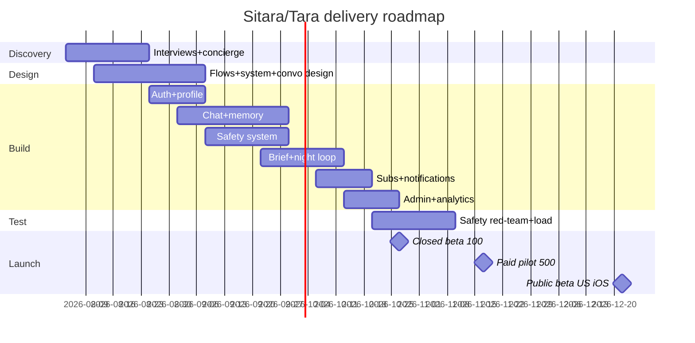

# Roadmap · Feature-Priority Matrix · Sprint Backlog

## Phase roadmap (Mermaid)

## Feature-priority matrix (value × effort, Phase 1)
| Feature | Value | Effort | Priority |
|---|---|---|---|
| Morning brief | Very high | M | P0 |
| Chat + framework router | Very high | L | P0 |
| Consent memory + centre | Very high | L | P0 |
| Safety system | Existential | M | P0 |
| Night reflection | High | S | P0 |
| Subscription + trial | High | M | P0 |
| Notifications + controls | High | S | P0 |
| Astro/numerology layer | High | M | P0 (engine v0 via API) |
| Goals | Med | S | P1 |
| Weekly summary | Med | S | P1 |
| Voice notes | Med | M | P1 |
| Mood trends | Med | S | P2 |
| iOS widget | Med | S | P2 |

## Sprint 1–2 backlog (2-week sprints, 2 eng + 1 AI eng)
S1: repo+CI+infra bootstrap · Firebase auth + user/profile service · onboarding screens (essential ring) · Prokerala engine adapter + chart compute · prompt registry + Tara persona v1 · safety classifier integration (vendor baseline) · PostHog events v0. Exit: signup→chart→first insight E2E on TestFlight.
S2: chat service + streaming + framework router (morning/emotional/decision) · memory write path + chips + centre v0 · brief generator job + brief UI · notification service + quiet hours · golden-convo suite v1 (100 cases). Exit: full day-loop dogfood internally.
S3–7 (headline): night flow; subscription; memory centre full; safety red-team + crisis UX; weekly summary; admin v0; beta hardening.
