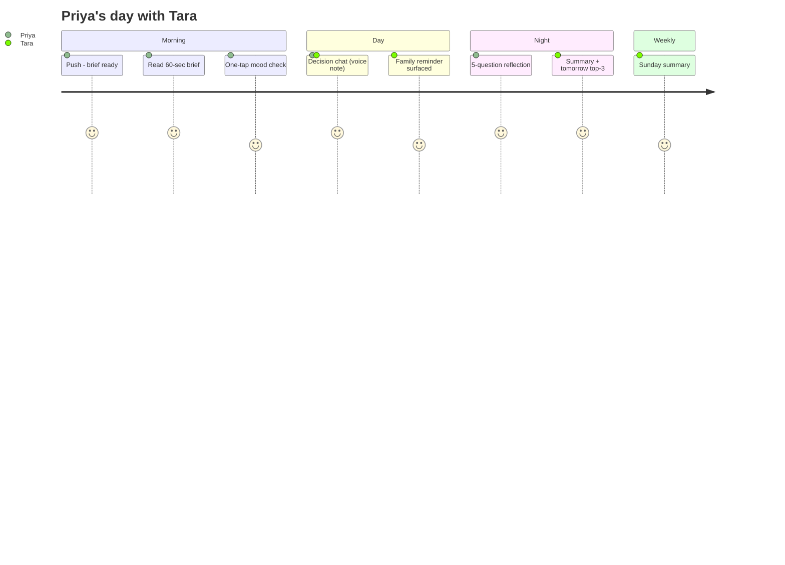
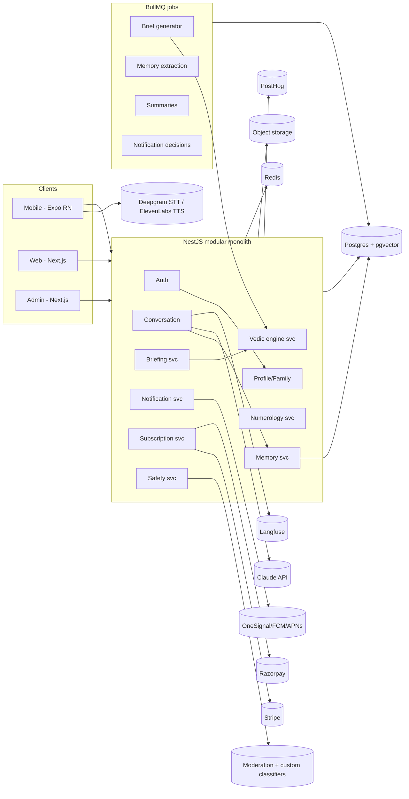
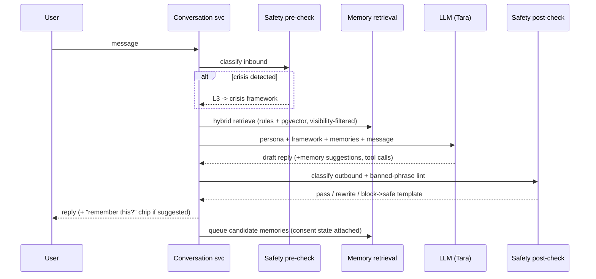
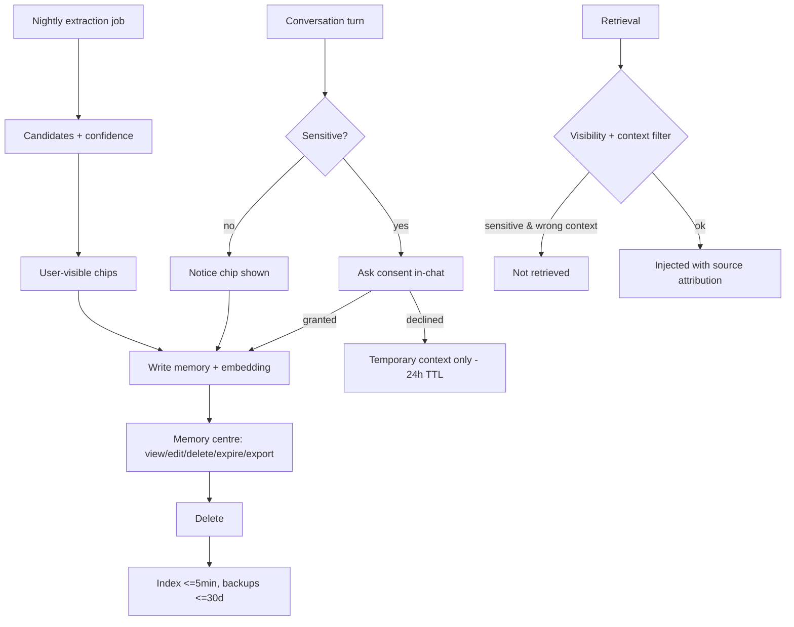
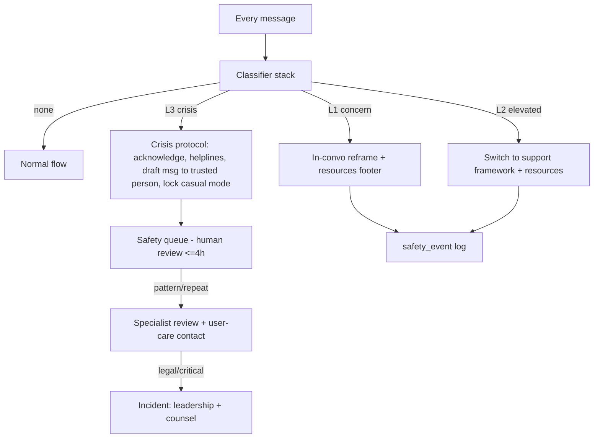
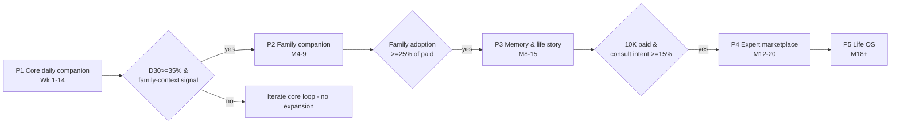

# System Architecture & Diagrams

## User journey

```mermaid
journey
  title Priya's day with Tara
  section Morning
    Push - brief ready: 5: Priya
    Read 60-sec brief: 5: Priya
    One-tap mood check: 4: Priya
  section Day
    Decision chat (voice note): 5: Priya, Tara
    Family reminder surfaced: 4: Tara
  section Night
    5-question reflection: 5: Priya
    Summary + tomorrow top-3: 5: Tara
  section Weekly
    Sunday summary: 4: Tara
```

## System architecture

```mermaid
flowchart LR
  subgraph Clients
    M[Mobile - Expo RN]
    W[Web - Next.js]
    A[Admin - Next.js]
  end
  subgraph API [NestJS modular monolith]
    AU[Auth] --> PR[Profile/Family]
    CV[Conversation] --> MEM[Memory svc]
    BR[Briefing svc] --> AST[Vedic engine svc]
    NU[Numerology svc]
    NT[Notification svc]
    SB[Subscription svc]
    SF[Safety svc]
  end
  subgraph Workers [BullMQ jobs]
    J1[Brief generator]
    J2[Memory extraction]
    J3[Summaries]
    J4[Notification decisions]
  end
  M & W --> API
  A --> API
  CV --> LLM[(Claude API)]
  SF --> MOD[(Moderation + custom classifiers)]
  MEM --> PG[(Postgres + pgvector)]
  API --> PG
  API --> RD[(Redis)]
  Workers --> PG
  J1 --> AST
  CV --> LF[(Langfuse)]
  NT --> OS[(OneSignal/FCM/APNs)]
  SB --> ST[(Stripe)] & RZ[(Razorpay)]
  M --> VG[(Deepgram STT / ElevenLabs TTS)]
  API --> S3[(Object storage)]
  API --> PH[(PostHog)]
```

## Data flow (one chat turn)

```mermaid
sequenceDiagram
  participant U as User
  participant API as Conversation svc
  participant S as Safety pre-check
  participant MEM as Memory retrieval
  participant L as LLM (Tara)
  participant SP as Safety post-check
  U->>API: message
  API->>S: classify inbound
  alt crisis detected
    S-->>API: L3 -> crisis framework
  end
  API->>MEM: hybrid retrieve (rules + pgvector, visibility-filtered)
  API->>L: persona + framework + memories + message
  L-->>API: draft reply (+memory suggestions, tool calls)
  API->>SP: classify outbound + banned-phrase lint
  SP-->>API: pass / rewrite / block->safe template
  API-->>U: reply (+ "remember this?" chip if suggested)
  API->>MEM: queue candidate memories (consent state attached)
```

## Memory flow

```mermaid
flowchart TD
  C[Conversation turn] --> X{Sensitive?}
  X -- yes --> ASK[Ask consent in-chat] -- granted --> W
  X -- no --> N[Notice chip shown] --> W[Write memory + embedding]
  ASK -- declined --> T[Temporary context only - 24h TTL]
  W --> MC[Memory centre: view/edit/delete/expire/export]
  MC --> DEL[Delete] --> PURGE[Index <=5min, backups <=30d]
  NIGHT[Nightly extraction job] --> CAND[Candidates + confidence] --> CHIPS[User-visible chips] --> W
  RET[Retrieval] --> VIS{Visibility + context filter}
  VIS -- sensitive & wrong context --> SKIP[Not retrieved]
  VIS -- ok --> INJ[Injected with source attribution]
```

## Safety escalation

```mermaid
flowchart TD
  MSG[Every message] --> CLS[Classifier stack]
  CLS -->|none| OK[Normal flow]
  CLS -->|L1 concern| SOFT[In-convo reframe + resources footer]
  CLS -->|L2 elevated| FRAME[Switch to support framework + resources]
  CLS -->|L3 crisis| CRISIS[Crisis protocol: acknowledge, helplines, draft msg to trusted person, lock casual mode]
  CRISIS --> QUEUE[Safety queue - human review <=4h]
  SOFT & FRAME --> LOG[safety_event log]
  QUEUE -->|pattern/repeat| L4[Specialist review + user-care contact]
  L4 -->|legal/critical| L5[Incident: leadership + counsel]
```

## Phase roadmap

```mermaid
flowchart LR
  P1[P1 Core daily companion\nWk 1-14] --> G1{D30>=35% &\nfamily-context signal}
  G1 -->|yes| P2[P2 Family companion\nM4-9] --> G2{Family adoption\n>=25% of paid}
  G2 -->|yes| P3[P3 Memory & life story\nM8-15] --> G3{10K paid &\nconsult intent >=15%}
  G3 -->|yes| P4[P4 Expert marketplace\nM12-20] --> P5[P5 Life OS\nM18+]
  G1 -->|no| FIX[Iterate core loop - no expansion]
```
